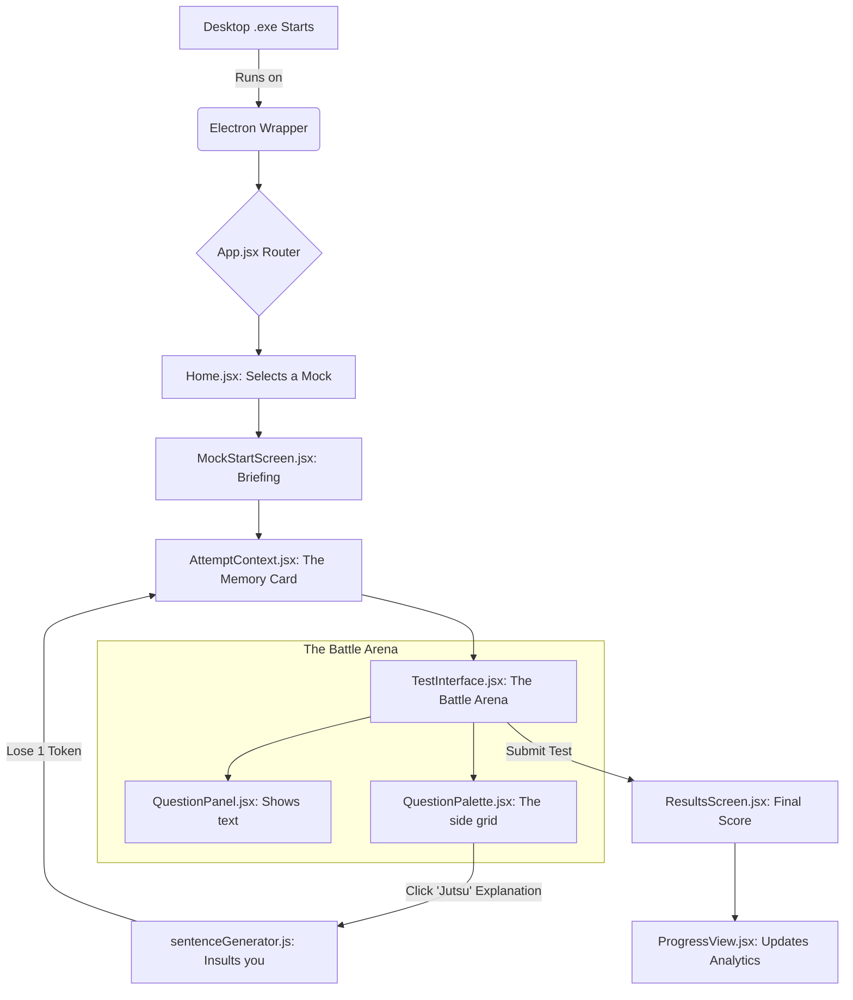

  
  <h1>CET Engine 2026: The Master Blueprint</h1>
  
<strong>The Ultimate Strategic Command Center for CET Examination Preparation</strong>

 

> **Welcome to the Blueprint.** Think of this application not as a boring test-taking website, but as a **video game**. Your brain is the main character, knowledge tokens are your currency, and the April 29th CET Exam is the final boss. This document explains exactly how the entire game was built from scratch so that a 14-year-old (or you, 5 years from now) can completely rebuild it.

---

## 🔺 The Pyramid Scheme Tree (Application Flow)

Here is exactly how data flows through the application. If you click a button, this is the path it takes through the files.

---

## 🗂️ The Complete Skeleton (File-by-File Breakdown)

*Click on any of the **Cards** below to reveal exactly how the code works inside.*

<h3>🃏 Card A: The Brain (Contexts & Logic)</h3>

These files are the invisible "memory cards" of the application. They run in the background and remember everything you do.

*   **`src/context/AttemptContext.jsx`**
    *   **What it does:** This is the most important file in the app. It saves your game.
    *   **`startAttempt(mockId)`:** When you start a test, this creates a blank save file (with a timer and empty answers).
    *   **`saveResponse(questionId, option)`:** Every time you click a radio button, this function instantly writes it to `localStorage` so if your computer crashes, your answers are saved.
    *   **`useExplanationToken()`:** Checks if you have more than 0 tokens. If you do, it deducts 1 token and lets you see an explanation.

*   **`src/context/MockContext.jsx`**
    *   **What it does:** This loads all 19 mock tests into memory.
    *   **`loadMocks()`:** It goes into the `data/mockPlan.js` file and prepares the schedule so the app knows how many questions are in each test.

*   **`src/utils/scoreCalculator.js`**
    *   **What it does:** The math engine.
    *   **`calculateScore(responses, questions)`:** It loops through every answer you gave. If it matches the `correct_answer`, it adds `+1`. If it's wrong, it subtracts `-0.25`.

<h3>🃏 Card B: The Battle Arena (The Test Interface)</h3>

These files control what you actually see on the screen while you are taking a test.

*   **`src/pages/TestInterface.jsx`**
    *   **What it does:** The main wrapper for the test. It holds the timer at the top, the question in the middle, and the grid on the right.
    *   **`handleTimeUp()`:** A strict function that automatically submits the test if the countdown timer hits 00:00.

*   **`src/components/test/QuestionPanel.jsx`**
    *   **What it does:** This renders the actual text of the question (e.g., "Who invented the computer?") and the 4 radio buttons (A, B, C, D).
    *   **`handleOptionSelect()`:** When you click an option, it sends a message up to `AttemptContext` to save it.

*   **`src/components/test/QuestionPalette.jsx`**
    *   **What it does:** The grid of numbers on the right side.
    *   **Color Logic:** It checks `AttemptContext`. If the question is answered, it turns the box Green. If visited but not answered, Red. If marked for review, Purple.
    *   **The Jutsu Button:** A special toggle that triggers the mocking modal before revealing the secret explanation.

<h3>🃏 Card C: Analytics (My Progress)</h3>

How the application judges your performance after the test is over.

*   **`src/pages/ResultsScreen.jsx`**
    *   **What it does:** The screen you see immediately after submitting a test. It shows your total score, how many you got right, and how many you skipped.

*   **`src/components/views/ProgressView.jsx`**
    *   **What it does:** The "My Progress" tab on the Home screen.
    *   **`calculateSubjectMastery()`:** A massive recursive function that digs through *every test you have ever taken*, sorts the questions by subject (English, Computer, GK, Reasoning), and calculates your exact accuracy percentage in that specific topic.

<h3>🃏 Card D: The Token Economy & Jutsu Engine</h3>

The psychological friction designed to stop you from cheating and relying on explanations.

*   **`src/utils/sentenceGenerator.js`**
    *   **What it does:** An algorithm that generates 10,000+ unique, insulting sentences.
    *   **How it works:** It contains 4 arrays of words (Openers, Actions, Judgments, Closers). When you try to buy an explanation, it picks one random word from each array and smashes them together. 
    *   *Example Output:* "Oh, you are relying on the Jutsu? This proves your brain is weak. A true shinobi would solve it themselves."

*   **The Token Math (`AttemptContext.jsx`)**
    *   You start with exactly **30 Global Tokens**.
    *   Every time you complete a full mock test, you earn **+5 Tokens**.
    *   Every time you click "View Explanation", you lose **-1 Token**.

<h3>🃏 Card E: The Shell & 3D Elements</h3>

*   **`src/components/shell/ShellLayout.jsx`**
    *   The glass container that holds everything.
*   **`src/components/shell/TopBar.jsx`**
    *   The top navigation bar that holds the "Schedule" button.
*   **`src/components/modals/CalendarModal.jsx`**
    *   The 24-hour Notion-style calendar that visually maps out your brutal 72-hour gauntlet schedule. It uses `createPortal` to float above the rest of the application.

---

## 💻 The Quality of Language (Tech Stack Explained Simply)

If you are a 14-year-old trying to understand what makes this code run, here is the secret recipe:

1.  **React 19 (The Builder):** Normally, websites load a completely new page when you click a link. React is a robot that rebuilds only the *parts of the screen* that change, instantly. That's why the timer ticks and the grid changes colors without the screen flashing.
2.  **Tailwind CSS (The Paintbrush):** Instead of writing thousands of lines of CSS styling rules, Tailwind gives us shortcuts. We just type `class="bg-blue-500 rounded"` and it instantly paints a blue box with rounded corners.
3.  **Glassmorphism (The Aesthetic):** We used custom CSS to blur the background behind the windows, making it look like frosted glass. We also overlaid an SVG noise filter (`/assets/noise.svg`) to give it a premium, textured feel.
4.  **Vite (The Compressor):** When we finish writing the code, Vite is the machine that crushes thousands of files into one tiny, lightning-fast package.
5.  **Electron (The Wrapper):** This takes our website package and wraps it inside a Chrome browser engine, completely hiding it, so it runs as a native, double-clickable `.exe` Windows application.

---

## 🏗️ How to Rebuild in the Future

If you completely delete your local database, format your hard drive, and pull this raw code from GitHub 5 years from now, here is exactly how to bring it back to life:

1.  **Install Node.js:** Download and install Node.js (the engine that runs JavaScript outside of a browser).
2.  **Open the Terminal:** Open Command Prompt or PowerShell in this folder.
3.  **Install Dependencies:** Type `npm install` and hit Enter. This downloads all the building blocks (React, Vite, Electron).
4.  **Run Development Mode:** Type `npm run electron:dev`. This will pop open the app so you can edit the code and watch it update live.
5.  **Compile the `.exe`:** Type `npm run electron:build`. Wait 2 minutes. Go into the `dist_electron` folder, and you will find your shiny new `.exe` application ready to be installed.

---

## 💾 Database Access & Commercial Inquiries

The source code for this engine is provided, but the **proprietary 19-Mock Question Database (JSON Data)** is intentionally withheld from this repository to protect intellectual property. 

If you are interested in acquiring the question database, licensing the software, or commercial usage, please message me directly on Instagram:
👉 **[Sebastin Richard (@ursabastin)](https://www.instagram.com/ursabastin?igsh=MWZ1bW9lZmp4bzlxeA==)**

 

  
<strong>Copyright © 2026 Sebastin Richard. All rights reserved.</strong>

  
<em>"Victory belongs to the most persevering."</em>

