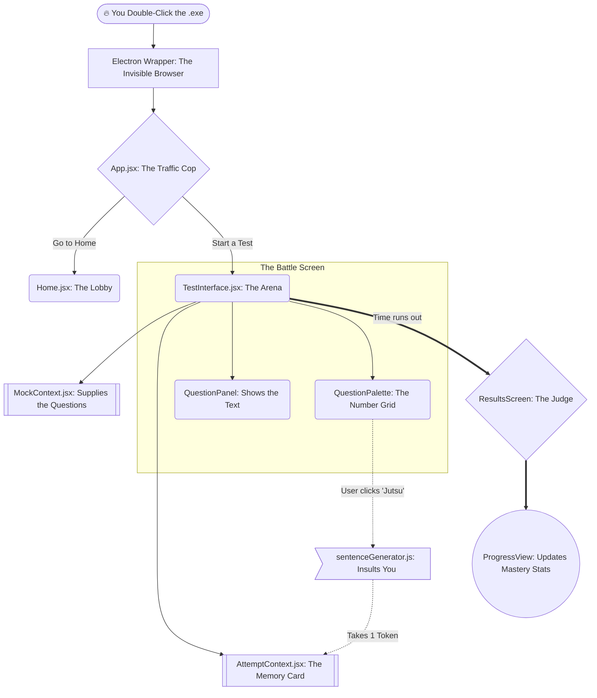

  
  <h1>⚡ CET ENGINE 2026 ⚡</h1>
  <h3><i>The Masterpiece. The Strategy. The Weapon.</i></h3>
  
Normal students read textbooks. Creators build engines.

 

> **"If you can't explain it to a 14-year-old, you don't understand it yourself."**
> 
> This isn't a boring academic project. This is a **gamified examination combat simulator**. I built this to hack my own brain for the April 29th CET Exam. It uses a custom-built Token Economy, psychological friction, and a stunning Glassmorphism interface to force active learning. 
> 
> If you are reading this 5 years in the future, or if you are just a kid trying to figure out how software is built—welcome to my brain. Here is exactly how this machine breathes.

---

## 🌳 The "Pyramid Scheme" Tree (How Data Flows)

Imagine the app like a giant waterfall. Water (data) falls from the top (the desktop app) all the way down to the bottom (the final score). Here is the exact map of the river:

---

## 🧩 The Anatomy of the Engine (Click to Open)

*Every file has a specific job. Click on the cards below to dive deep into the specific organs of this application.*

<strong>🧠 The Brain Room (Logic & Memory)</strong>

 

These files don't show anything on the screen. They live in the shadows and do the math.

*   **`AttemptContext.jsx` (The Save File)**
    *   *What it does:* This is a massive "Memory Card". It remembers how many tokens you have, which radio button you clicked, and how much time is left.
    *   *Core Functions:* 
        *   `saveResponse()`: Instantly writes your clicked answer to the hard drive (`localStorage`) so you don't lose data if the app crashes.
        *   `useExplanationToken()`: The bank. It checks if you have `> 0` tokens. If yes, it subtracts one and lets you see the secret answer.

*   **`MockContext.jsx` (The Librarian)**
    *   *What it does:* It holds all 19 mock tests in its hands and hands them out when the user asks for one.

*   **`scoreCalculator.js` (The Mathematician)**
    *   *What it does:* It loops through your answers. If you are right: `+1`. If you are wrong: `-0.25`. It is ruthless and accurate.

<strong>⚔️ The Arena (The Visuals)</strong>

 

These files are the actual buttons, text, and colors you see and touch.

*   **`TestInterface.jsx` (The Colosseum)**
    *   *What it does:* It puts the Timer on top, the Question in the middle, and the Grid on the right. It connects the "Brain" to the "Visuals".

*   **`QuestionPalette.jsx` (The Side Grid)**
    *   *What it does:* The grid of 150 numbers. It talks to the Brain. "Hey Brain, did the user answer question 42?" If yes, it paints box 42 **Green**. If no, **Red**. 
    *   *The Jutsu Button:* This is the button that unlocks the explanation. It triggers a popup modal that forces you to think before spending a token.

<strong>😈 The Jutsu Generator (Psychological Warfare)</strong>

 

*   **`sentenceGenerator.js` (The Roaster)**
    *   *What it does:* It stops you from cheating by making you feel bad for looking at the answer.
    *   *How it works:* It has 4 lists of words (Start, Action, Judgment, End). Every time you click "View Explanation", it randomly grabs one word from each list and stitches them together to create **10,000 unique insulting sentences**.
    *   *Example:* "Oh, you are relying on the Jutsu? A true shinobi would solve it themselves."

<strong>📈 The Analyst (My Progress)</strong>

 

*   **`ProgressView.jsx` (The Tracker)**
    *   *What it does:* It digs through every test you've ever taken, sorts the questions by subject (Computer, English, etc.), and calculates your exact accuracy percentage across your entire lifetime of using the app.

---

## 🧪 The Alchemy (Languages Used)

How do you build something like this? You use the right spells. 

| Spell | Translation for a 14-Year-Old | Why I Used It |
| :--- | :--- | :--- |
| **React 19** | The magic builder robot. | Instead of loading a new web page every time you click a button, React just swaps out the text instantly. It makes the app feel like a fast video game instead of a slow website. |
| **Tailwind CSS** | The instant paintbrush. | Instead of writing thousands of lines of code just to make a box blue, I can just type `"bg-blue-500"`. It makes styling 10x faster. |
| **Vite** | The hyper-compressor. | When the code is finished, Vite crushes thousands of files into one tiny, lightning-fast bundle in milliseconds. |
| **Electron** | The disguise kit. | It takes a normal website and wraps it inside an invisible Chrome browser, turning it into a native `.exe` Windows app that you can double-click on your desktop. |

---

## 🧟 The Resurrection Protocol (How to Rebuild)

If I delete this entire app from my local computer, and I want to bring it back to life 5 years from now, here is the exact ritual to perform in the terminal:

1.  **Summon the Tools:** Download and install `Node.js` on your PC.
2.  **Open the Portal:** Open PowerShell or Command Prompt inside this folder.
3.  **Gather Materials:** Type `<kbd>npm install</kbd>`. This downloads all the dependencies (React, Electron, etc.) from the internet.
4.  **Enter the Matrix:** Type `<kbd>npm run electron:dev</kbd>`. This boots up the app in "Live Edit Mode" so you can change the code and watch it update instantly.
5.  **Forge the Weapon (.exe):** Type `<kbd>npm run electron:build</kbd>`. Wait 2 minutes. A shiny new `CET Engine 2026.exe` will pop out in the `dist_electron/` folder, ready to be installed.

---

## 💎 The Vault (Commercial Access)

The code you see here is public. But the **Proprietary 19-Mock Question Database (The JSON Data)**—thousands of highly curated CET questions—is intentionally hidden and stripped from this repository to protect my intellectual property.

If you are a student, an institute, or a developer interested in acquiring the database, licensing the software, or requesting a custom build, message me directly:

**👉 [Sebastin Richard on Instagram (@ursabastin)](https://www.instagram.com/ursabastin?igsh=MWZ1bW9lZmp4bzlxeA==)**

---

  
<i>Architected & Built by <strong>Sebastin Richard</strong>.</i>

  
<i>"Victory belongs to the most persevering."</i>

