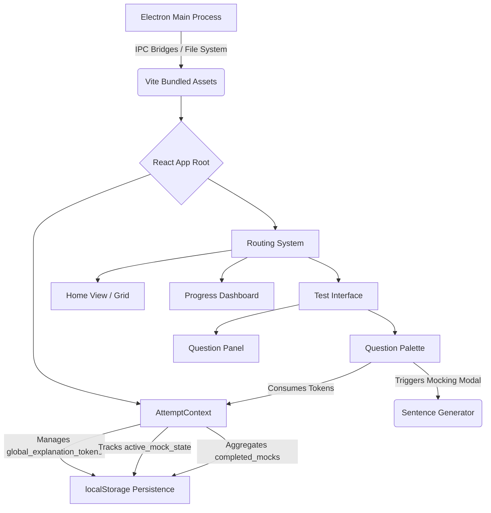

<div align="center">
  <h1>CET Engine 2026</h1>
  <p><strong>The Ultimate Strategic Command Center for CET Examination Preparation</strong></p>
  <p><em>Version 1.0.0 — Production Release</em></p>
</div>

---

## 📌 Executive Summary

**CET Engine 2026** is a meticulously engineered, offline-first, high-performance Desktop application explicitly designed for serious aspirants of the 2026 CET Examinations. 

Moving beyond standard testing applications, this engine is built with a deep understanding of exam psychology, cognitive endurance, and strategic preparation. It combines an **Industry-Standard CBT (Computer-Based Test) Interface** with an advanced **Gamified Token Economy** to discourage passive learning, forcing candidates to rely on their own intellect before seeking explanations. 

Coupled with a **Deep Analytics Engine** that tracks mastery across granular subjects, and an integrated **Battle Plan Calendar** optimized for peak human endurance, this application represents the pinnacle of autonomous study tools.

---

## 🏛️ System Architecture & Technology Stack

The application leverages a modern, isolated Desktop architecture. It separates the heavy lifting of the UI rendering from the native OS capabilities using Electron's IPC (Inter-Process Communication) model.

### Technology Stack Table

| Layer | Technology | Purpose |
| :--- | :--- | :--- |
| **Container** | Electron (v41+) | Provides a secure, native desktop window and OS-level file system access. |
| **Frontend Core** | React 19 | Drives the complex, highly interactive, state-driven UI of the test engine. |
| **Routing** | React Router v7 | Manages seamless SPA transitions between Home, Tests, and Analytics. |
| **Styling** | Tailwind CSS v4 & Vanilla CSS | Powers the custom "Glassmorphism" design system via raw CSS variables. |
| **Build Tooling** | Vite | Ensures lightning-fast HMR during development and optimized chunking in production. |
| **Icons & Assets** | Lucide React | Provides crisp, scalable vector iconography across the interface. |

### Application State Architecture



---

## 💻 Interface & Layout Mechanics

The interface is built strictly around the principles of **Glassmorphism**, heavily utilizing `backdrop-filter: blur()`, semi-transparent backgrounds (`rgba`), and glowing accent borders to create a distraction-free, highly immersive environment.

### 1. The Shell & Navigation
The application shell consists of a persistent `TopBar` and `NavRail`. 
*   **The TopBar**: Displays the dynamic "Exam Countdown" clock and houses the crucial **Schedule Calendar** toggle.
*   **The NavRail**: A vertical sidebar allowing fluid transitions between the Mock Selection Grid and the Progress Dashboard.

### 2. The Mock Test Interface (CBT Simulator)
The core of the application accurately mimics standard examination software (like TCS iON) to build muscle memory.
*   **The Header**: Features a locked countdown timer that visually warns the user as time expires.
*   **The Question Panel**: Renders dynamic question data. 
*   **The Action Bar**: Contains critical navigation (`Save & Next`, `Mark for Review`, `Clear Response`).
*   **The Status Palette**: A color-coded grid on the right side showing the exact state of all 100 questions (Answered, Not Answered, Not Visited, Marked for Review).

---

## 🪙 The Token Economy & Explanation System

To combat "explanation reliance"—a common trap where students immediately view answers instead of struggling through a problem—the engine features a highly customized **Gamified Token Economy**.

### Mechanics of the Token System:
1.  **Initial Balance**: The user starts with exactly **30 Explanation Tokens** (`global_explanation_tokens`).
2.  **The Cost**: Unlocking the explanation for *any* question costs exactly **1 Token**.
3.  **The Earnings**: The only way to earn more tokens is to fully submit and complete a Mock Test, which rewards the user with **5 Tokens**.
4.  **Session Persistence**: Once a question's explanation is unlocked, it remains visible for the duration of that specific mock session without requiring additional tokens.

### The "Jutsu" Mocking Engine
Before a token is consumed, the application actively attempts to dissuade the user. Clicking "View Explanation" triggers an aggressive, cinematic modal.
*   The modal utilizes a robust `sentenceGenerator.js` utility.
*   By procedurally combining 4 sets of narrative fragments (Prefixes, Actions, Alternatives, and Conclusions), the engine generates exactly **10,000 unique, mildly insulting, Shinobi-themed sentences** (e.g., *"Hold on, Shinobi! A true warrior doesn't beg for answers when their back is against the wall. Think harder!"*).
*   The user must physically click "I'm Weak, Show Me" to spend the token, adding psychological friction to the act of giving up.

---

## 📈 Deep Analytics & Subject Mastery

The **"My Progress"** tab serves as the ultimate diagnostic dashboard. It does not merely show scores; it dissects the user's brain.

### Key Metrics Tracked:
*   **Global Accuracy rate**: Overall hit-rate across thousands of questions.
*   **Performance Tier**: Dynamically calculated based on accuracy percentiles (e.g., *Novice*, *Adept*, *CET Master*).
*   **Subject Mastery Grid**: The engine recursively iterates through the entire history of `completed_mocks` stored in `localStorage`. It maps every single question ever attempted to its parent subject (English, Reasoning, General Knowledge, Computer Awareness) and calculates an isolated accuracy ratio for that specific domain.

This allows the user to immediately recognize if their overall score is being dragged down by a specific subject, allowing for hyper-targeted study sessions.

---

## 🗓️ The 72-Hour Battle Plan

With 19 Mocks (18 Full 2-hour mocks, 1 Mixed 40-minute mock) and only a few days until the exam, the engine comes pre-configured with a grueling, highly-optimized **Schedule Calendar** (accessible via the TopBar).

The schedule is designed around a **4:00 AM to 9:30 AM sleep cycle**, utilizing exactly 46 waking hours to execute 36.6 hours of testing.

### The Schedule Layout
*   **Day 1 (Sunday): The Startup** — 5 Full Mocks. Focus on building momentum.
*   **Day 2 (Monday): The Marathon** — 7 Full Mocks. The ultimate test of cognitive endurance.
*   **Day 3 (Tuesday): Final Calibration** — 7 Mocks (including the 40-minute speed run). Ends with a massive review session and a shift to an earlier sleep schedule before Exam Day.

The calendar visually renders these blocks using a custom Notion-style absolute-positioned grid, dynamically categorizing blocks into *Mocks*, *Review Windows*, and *Ideal Sleep*.

---

## 📂 Complete Directory Structure

```text
C:\Projects\Cet_engine\
│
├── data set/                       # The immutable JSON Database
│   ├── Computer/                   # 19 Mocks worth of Computer questions
│   ├── English/                    # 19 Mocks worth of English questions
│   ├── GK/                         # 19 Mocks worth of GK questions
│   └── Reasoning/                  # 19 Mocks worth of Reasoning questions
│
├── electron/
│   ├── main.js                     # Electron Bootstrapper & IPC Handlers
│   └── preload.cjs                 # Secure bridge between Node & React
│
├── public/
│   └── assets/                     
│       ├── icon.png                # App Icon
│       └── noise.svg               # SVG Filter for Glassmorphism Texture
│
├── src/                            # React Source Code
│   ├── components/                 
│   │   ├── modals/                 # CalendarModal, ResultModal
│   │   ├── shell/                  # TopBar, NavRail, ContentArea
│   │   ├── test/                   # QuestionPanel, QuestionPalette
│   │   └── views/                  # Home, ProgressView
│   │
│   ├── context/
│   │   └── AttemptContext.jsx      # Global State & Token Economics
│   │
│   ├── data/
│   │   └── mockPlan.js             # Configuration for the 19 Mock Tests
│   │
│   ├── pages/
│   │   └── TestInterface.jsx       # The core CBT Simulator layout
│   │
│   ├── utils/
│   │   ├── questionLoader.js       # Vite Import Glob aggregator
│   │   └── sentenceGenerator.js    # Procedural generation for Mocking Modal
│   │
│   ├── App.jsx                     # Root Router Configuration
│   ├── index.css                   # Tailwind directives & CSS Variables
│   └── main.jsx                    # React DOM Entry Point
│
├── package.json                    # Dependencies & Build Scripts
└── vite.config.js                  # Vite configuration
```

---

## 🛠️ Build & Compilation Instructions

To modify, run, or build this engine from the source code, follow these precise terminal instructions:

### 1. Development Mode
To work on the React codebase with hot-reloading while the Electron window is active:
```bash
npm run electron:dev
```
*Note: This utilizes `concurrently` to boot Vite on `localhost:5173` and attaches the Electron window to it.*

### 2. Compiling for Production (.exe)
To package the application into a distributable Windows executable:
```bash
npm run electron:build
```
This script executes two steps:
1.  `vite build`: Compresses and minifies all React code, CSS, and the *entire JSON data set* into standard web assets inside the `/dist` directory.
2.  `electron-builder`: Wraps the `/dist` output and Node modules into native Windows binaries.

**Output Locations:**
*   **Installer**: `dist_electron/CET Engine 2026 Setup 1.0.0.exe`
*   **Portable Executable**: `dist_electron/CET Engine 2026 1.0.0.exe`

---

## 🏆 Credits & Acknowledgements

This application was conceptualized, architected, and built by a highly specialized three-entity team:

1.  **Sebastin Richard** — The mastermind behind the raw logic, complete skeleton design, token economy concepts, and comprehensive application architecture. Sebastin provided the exact psychological parameters and layout requirements for the engine.
2.  **Google Antigravity IDE** — The primary engineering AI agent that autonomously wrote, assembled, styled, and debugged the complete application codebase, including the complex Vite/Electron build systems.
3.  **Claude AI** — The strategic advisor AI that provided step-by-step guidance, planning, and tactical oversight throughout the initial construction phases.

<br/>
<div align="center">
  <p><strong>Copyright © 2026 Sebastin Richard. All rights reserved.</strong></p>
  <p><em>"Victory belongs to the most persevering."</em></p>
</div>
